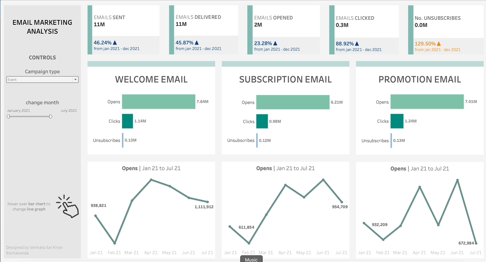

# Email Marketing Analysis Dashboard - Tableau

## Overview
This Tableau dashboard is designed for a detailed analysis of different email marketing campaign types, including Welcome Campaigns, Subscription Campaigns, and Promotional Campaigns. It focuses on interactive visualization of key metrics such as open counts, click counts, and unsubscribe counts.

## Features
- **Interactive Hover Views:** Showcases open counts, click counts, and unsubscribe counts for various campaign types.
- **Campaign Type Analysis:** Separate analysis for Welcome Campaigns, Subscription Campaigns, and Promotional Campaigns.
- **Event Tracking:** Tracks all events associated with each campaign type.
- **User Engagement Metrics:** Delivers insights into how different campaign types engage the audience.

## Dashboard Preview

## Getting Started
### Prerequisites
- Tableau Desktop or Tableau Public.
- Email marketing campaign data.

### Installation and Usage
1. Clone or download this repository.
2. Open the `Email_Marketing_Analysis.twbx` file in Tableau.
3. Connect to your email marketing campaign data.
4. Navigate through the dashboard to analyze performance metrics across various campaign types.

## Developed by
This dashboard was developed by Venkata Rachakonda, employing expertise in data visualization and email marketing analytics.

## Contributing
Your contributions are welcome. Feel free to fork this repository and propose changes through pull requests.
